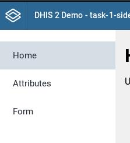
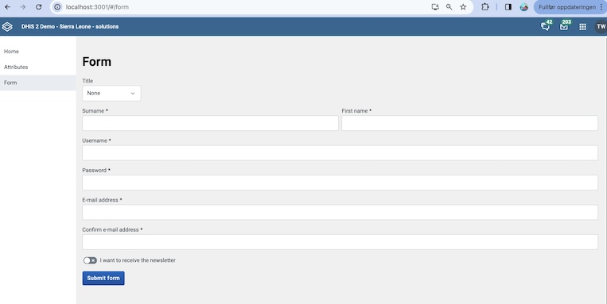
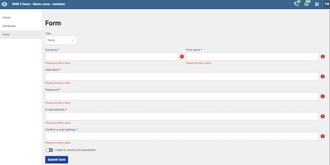

:::tip[What you will learn]
- [ ] An overview of the DHIS2 UI Component library
- [ ] How to access and effectively use documentation for the DHIS2 UI library
- [ ] Menu / MenuItem components and approaches for creating menus and navigation in DHIS2
- [ ] Table components and how to format large quantities of data
- [ ] Form logic in DHIS2, including how to use validators from DHIS2 UI library
- [ ] How to make your app be adaptable for use in multiple languages.      
:::

## Introduction

### UI Library

As we learned yesterday, at DHIS2 we have a design system which is a collection of design principles and
a library of UI components for designing applications for the DHIS2 platform.
Using this system you can design and build applications that are usable,
powerful and consistent with other DHIS2 applications.

The UI library is our implementation of that design system for react
environments. It's used by the DHIS2 core developers as well as by 3rd party
dhis2 apps.

The main library, called `ui`, is the complete library and re-exports all
components from our individual libraries. It's therefore the better choice when
developing apps as it exports the components in a flat structure and works
independent of structural changes in our individual libraries.

#### Installation

It can be added to a project with both yarn (recommended) or npm:

**yarn:**

```bash
yarn add @dhis2/ui
```

#### Documentation

The documentation of the UI library can be found here: [https://ui.dhis2.nu](https://ui.dhis2.nu/#/).

This main documentation incorporates a number of demos, but there are many additional demos available on our [Storybook page](https://ui.dhis2.nu/demo/). For each component, you will see a number of demos and its different variations and how they interact with props. Check these out and don't forget that you can see code implementation details under the JSX tab.

<a name="intro--workshop-intro" href=""></a>

## Workshop tasks introduction

There are three main tasks to be completed.

The instructions on this page will provide a guide to help you complete the tasks, but you will need to consult our UI documentation and Storybook page to find implementation details.

<a name="workshop-environment" href=""></a>

### Workshop environment

Throughout the academy, you will be working on a sample project. This project contains some sample code that you can use as a starting point.

Please follow [this step-by-step guide](../resources/GET_STARTED.md#working-on-directories-that-contain-starter-code) on how to setup your local enviornment and start working on this assignment.

:::warning[important]
Make sure that you work on the code in the `workshop` directory.
Throughout the course, you will be able to check your own work against solutions. The solutions are available on separate branches in a solutions directory. Excercises include links to the specific resources to look at.  
:::

<a name="src-structure" href=""></a>

### Structure inside the `workshop/src` folder

```
|- /src
|    # Hook to simulate data fetching
|--- /hooks
|------ index.js
|------ useGetAttributes.js
|    # Navigation module
|--- /navigation
|------ Navigation.js
|------ index.js
|    # Contains the page components
|--- /views
|------ Home.js
|------ Attributes.js
|------ Form.js
|------ Form.module.css
|------ index.js
|    # Contains the routing
|--- App.js
|--- App.module.css
|--- App.test.js
```

<a name="task-1" href=""></a>

## Task 1 - Navigation

### Task 1.1 - Navigation with the Menu and MenuItem component

:::info[Requirement]
Use DHIS2 UI Components Menu/MenuItem to implement sidebar navigation (in `workshop/src/navigation/Navigation.js`)
:::

The sidebar is required to navigate to the pages you will work on in the next two tasks.

<a name="task-1--expected-result" href=""></a>

### The expected result

Once all steps have been completed, the sidebar should look like this:



<a name="task-1--existing-code" href=""></a>

### Existing code in the template

The template already contains all necessary code except for the ui components.
You don't have to worry about creating the app or compose the routing.

The page consists of three pages:

1. Homepage
1. Attributes
1. Form

The components for these pages can be found in `workshop/src/views/`, but they don't need
to be touched in order to get this working.

The `workshop/src/App.js` renders a component called `Navigation`. It already exists in
`workshop/src/navigation/Navigation.js`. This is the file that you have to work on.

<a name="task-1--completing-the-task" href=""></a>

### Tips for completing the task

As you can see, there are three menu items. These are already prepared in the
code of the navigation, but the actual components are missing.

You'll have to import both the `Menu` and the `MenuItem` components from
`@dhis2/ui`. Refer to the [documentation](https://ui.dhis2.nu/components/menu) for implementation details.

Then you can replace the placeholder elements (look for the `@TODO` comments)
with the components you just imported.

If all the components have been added correctly, you should be able to navigate
to the `Home`, `Attributes` and `Form` pages, which so far display nothing but
an `h1`.

:::note[reflection]
Have you finished early? Take a look at the code in `workshop/src/App.js` and look at the implementation of the routing. We are using [react-router-dom](https://reactrouter.com/en/main). If you are not familiar with react-router-dom, we recommend that you take a look at the documentation.
:::

### Solutions

:::note[Solution]
Look at the [Navigation.js file here](https://github.com/dhis2/academy-web-app-dev/blob/day2-task1-solution/solutions/src/navigation/Navigation.js) for an example of how to solve this.
:::

<a name="task-2" href=""></a>

## Task 2 - Tables and displaying data

After the sidebar has been added, you can navigate to the attributes page.
On this page some attributes information from the database is displayed.
This attribute information should be formatted in a table.

If you did not complete the first task, make sure you copy/paste the solution into your code so that you can navigate to the attributes page. Note that you can also add `#/attributes` to the app url to navigate directly to the attributes page.

<a name="task-2--expected-result" href=""></a>

### The expected result

Once all steps have been completed, the attributes page should look like this:


<a name="task-2--existing-code" href=""></a>

### Existing code in the template

The file you are going to work on is `workshop/src/views/Attributes.js`. This code uses a dummy hook that simulates the data fetching from DHIS2.

We will talk about how to load data from DHIS2 tomorrow,so for now, don't worry about the implementation.
There are three values (`loading`, `error` & `data`) and the `data` one is the
only one that you have to handle. With a real data query, you will need to wait for the data to finish loading before it is accessible, but with this practice exercise, it will be available immediately.

The data will have the following shape:

```js
{
    attributes: {
        attributes: [
            {
                id: string,
                displayName: string,
                unique: bool,
            }
        ]
    }
}
```

<a name="task-2--completing-the-task" href=""></a>

### Task 2.1 Table for data

:::info[Requirement]
Use DHIS2 UI Components for Table to implement a table displaying attributes returned from the system (in `workshop/src/views/Attributes.js`)
:::

We are going to use the Table components. Check out the [documentation](https://ui.dhis2.nu/components/data-table) and the [Storybook demos](https://ui.dhis2.nu/demo/?path=/story/table--static-layout). Note that there are both `<DataTable>` and `<Table>` components; in this exercise, it is recommended that you use `<Table>`.

When displayed correctly, each row will
have two cells, one for name (`displayName`) and one for whether the attribute is
unique or not ( `unique`).

Remember that `data.attributes.attributes` is an array, you'll have to map each item to a
table row that displays the relevant data. It is probably easier, however, to start by making a table with a single row (by taking the first attribute from `data.attributes.attributes`). Then you can expand the logic to display all the attributes.

### Task 2.2 Handle loading state

:::info[Requirement]
Use a loader component from DHIS2 UI Component library that displays when data retrieval is in `loading` state
:::

When fetching data, you will generally need to wait for data to be returned from the server. During this time in `loading` state, you will want to provide an indication to users that something is happening, for instance by displaying a loader. Take a look at the components listed in the UI documentation and see if you can find one that you can use to indicate loading state. Modify the code in `workshop/src/views/Attributes.js` to display the loader when in loading state. Try to center the loader on the page (hint: you can use the component `<CenteredContent>` from dhis2-ui library, or you can use css).

### Task 2.3 Handle errors

:::info[Requirement]
Use a NoticeBox from DHIS2 UI Component library that displays when data retrieval fails
:::

Unfortunately, sometimes things go wrong when fetching data. This can happen for instance when the server time outs or when the user tries to access a resource that does not exist. Throughout DHIS2, we use notice boxes to display important notices to users. Look at the UI documentation and read up on the NoticeBox component. Modify the code, to show an Notice Box if there's an error returned from the data retrieval hook.

Note: with the template code, you will never actually be in an error state! To simulate an error, see if you can modify the hook provided in `workshop/src/hooks/useGetAttributes.js`. Hint: you do not want to throw an error from the hook, but rather want the error value returned from the hook _be_ an error, rather than `null`.

### Solutions

:::note[Solution]
Look at the [Attributes.js file here](https://github.com/dhis2/academy-web-app-dev/blob/day2-task2-solution/solutions/src/views/Attributes.js) for an example of how to solve this.
:::

<a name="task-3" href=""></a>

## Task 3 - Forms

The final task will be the one that will take most of the time.
The goal is to have a fully functional form that won't submit until all
required fields have a value and their value is not invalid.

If you did not complete the first task, make sure you have copy/pasted the solution into your code so that you can navigate to the form page. Note that you can also add `#/form` to the app url to navigate directly to the form page.

<a name="task-3--expected-result" href=""></a>

### The expected result

We will create a form that can be used to collect user details that could be submitted (for example for registering a new user)

Once all steps have been completed, the form page should look like this:



The specific values that we are collecting in the field are:

| Field name    | Description                                                          | Validation                                                 |
| ------------- | -------------------------------------------------------------------- | ---------------------------------------------------------- |
| title         | This should be a select with three options (None, Professor, Doctor) | Cannot be empty                                            |
| surname       | Input field expecting a string                                       | Cannot be empty                                            |
| firstname     | Input field expecting a string                                       | Cannot be empty                                            |
| username      | Input field expecting a string                                       | Cannot be empty, Must be a valid DHIS2 username            |
| password      | Input field expecting a string                                       | Cannot be empty, Must be a valid DHIS2 password            |
| email         | Input field expecting a string                                       | Cannot be empty, Must be a valid e-mail address            |
| confirm_email | Input field expecting a string                                       | Cannot be empty, Must match the value of the `email` field |

If the form validation fails, then the form should contains the respective
error message. In the following image all fields that have a validation
function are invalid:



<a name="task-3--code-to-use" href=""></a>

### Task 3.1 React Final Form + DHIS2 UI Components

:::info[Requirement]
Using React Final Form `Field` component and the DHIS2 form components to implement the registration form (work in `workshop/src/views/Form.js`)
:::

The DHIS2 UI Library provides a number of tools to implement form logic with [react-final-form](https://final-form.org/react), which we use for building forms. There are other popular form libraries for React (for example, [Formik](https://formik.org/) or [React Hook Form](https://react-hook-form.com/)).

Let's look at the basic structure of React Final Form's `<Field>` component:

```
    <Field
        name="fruit"
        label="Fruit"
        type="password"
        component={SingleSelectFieldFF}
        className={'fruitField'}
        initialValue="a"
        options={[
            { label: 'apple', value: 'a' },
            { label: 'banana', value: 'b' },
            { label: 'mango', value: 'm' },
        ]}
        validate={hasValue}
    />
```

The `<Field>` component above has all of the properties that we will be working with in this exercise. Here's a brief overview of what they do:

| Property     | Description                                                                                                                                                     |
| ------------ | --------------------------------------------------------------------------------------------------------------------------------------------------------------- |
| name         | The value for this field will have the associated `name`. E.g. if `name: fruit`, then in the `values` object, the value for the field will be at `values.fruit` |
| label        | The label that will be displayed in the UI for the field                                                                                                        |
| type         | if you need to hide the text while typing, you can set `type="password`, otherwise `type` can be left as null                                                   |
| component    | Here you can specify the component you want to use to select the value for the Field                                                                            |
| className    | For styling                                                                                                                                                     |
| initialValue | Provides an initial value for the field                                                                                                                         |
| options      | If the component is a select, this property defines the options that should be selectable                                                                       |
| validate     | Defines a validator that will check if the entered value is valid. The field has to be touched before the validator will be applied                             |

#### DHIS2 UI Components for React Final Form

For components, the DHIS2 UI library provides a number of Field inputs that are designed to be used with React Final Form. The ones that you ned for this task are: `InputFieldFF` `SingleSelectFieldFF`, `SwitchFieldFF`.

If you need to look at documentation for these components, you can generally refer to the non Final Form field of the documentation (e.g. for [InputField](https://ui.dhis2.nu/components/inputfield), [SingleSelectField](https://ui.dhis2.nu/components/select), and [SwitchField](https://ui.dhis2.nu/components/switch)).

### Task 3.2 Add validation logic to form

:::info[Requirement]
Use validators from DHIS2 UI library to implement form validation
:::

The DHIS2 UI library exposes a number of validators that can be used to check that the value of the field is valid. The [documentation](https://ui.dhis2.nu/utilities/forms/validators) has details on the specific validators.

The validation for the individual fields should be as follows:

1. `surname`
   - Cannot be empty
1. `firstname`
   - Cannot be empty
1. `username`
   - Cannot be empty
   - Must be valid DHIS2 username
1. `password`
   - Cannot be empty
   - Must be valid DHIS2 password
1. `email`
   - Cannot be empty
   - Must be a valid e-mail address
1. `confirm_email`
   - Cannot be empty
   - Must match the value of the `email` field

The first thing you should try to do is identify the appropriate validators to use by reading through the documentation for validators.

If a field needs multiple validators, the `composeValidators` function can be
used to use as many as needed:

```jsx
validate={composeValidators(
    validator1,
    validator2
)}
```

All validators mentioned above in this task are exported directly from
`@dhis2/ui`. You can also write your own validators in your apps. Please
refer to the docs of
[`react-final-form`](https://final-form.org/docs/react-final-form/getting-started)
for more information.

:::note[reflection]
Have you finished early? Look at the implementation of the form logic in dev tools as you interact with the form. Is the form efficient? What are some disadvantages of the current implementation? Think of ways you might improve the implementation.
:::

### Solutions

:::note[Solution]
Look at the [Form.js file here](https://github.com/dhis2/academy-web-app-dev/blob/day2-task3-solution/solutions/src/views/Form.js) for an example of how to solve this.
:::

## Task 4 - Internationalization

Part of making reusable DHIS2 apps means making apps that work in multiple languages and in multiple settings.

### Task 4.1 Add translation strings

:::info[Requirement]
Wrap strings in the app in i18n (start in workshop/src/views/Home.js ).
:::

Refer to the [documentation for setting up translations](https://developers.dhis2.org/docs/guides/translation-support/) in your app.

When you have wrapped the strings, generate the translation strings. You can then create a new translation file (e.g. copy the en.pot and rename it as fr.po) and add some test translations. Try the translations out by logging in with a new user and changing their locale language (click on the avatar in the upper-right of the header bar)

### Task 4.2 Support RTL Languages

:::info[Requirement]
Enable your app to work with RTL languages.
:::

DHIS2 UI components are designed to work with languages written in right-to-left script. By default, when you build an app using the DHIS2 app-platform, it will be assumed to be LTR. You can

In `workshop/d2.config.js`, set `direction: 'auto'`. Change the user language to Arabic and see if the direction reverses. Note: you may need to update some of the css files to make the layout work correctly. [This article](https://css-tricks.com/css-logical-properties-and-values/) provides a good overview of CSS logical properties.

### Solutions

:::note[Solution]
Look at the [code here](https://github.com/dhis2/academy-web-app-dev/tree/day2-task4-solution/solutions). Look particularly at src/App.js, src/views/Home.js, the i18n directory, and d2.config.js.
:::